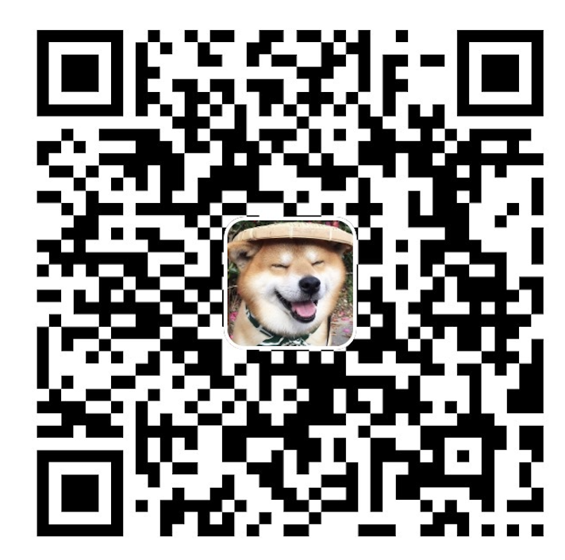

## Mov2mov

适用于Automatic1111/stable-diffusion-webui 的 Mov2mov 插件。

功能：
- 直接从视频逐帧处理
- 处理完成后打包成视频
- 对视频进行抠图，合成等预处理和后处理
  - 抠取人像
  - 合成透明背景
  - 合成原背景
  - 合成绿幕
  - 合成指定图片背景
  - 合成指定视频背景
- 逐帧处理prompt和negative_prompt：
  - 以 *帧数:prompt|| 标记 *开始 ||结束
  - *1:1girl||*100:2girl|| 第一帧使用1girl到第99帧，然后第100帧开始使用2girl到结束。
  - negative_prompt也同样。

## 安装方法

1. 打开扩展（Extension）标签。
2. 点击从网址安装（Install from URL）
3. 在扩展的 git 仓库网址（URL for extension's git repository）处输入 
4. 点击安装（Install）
5. 重启 WebUI

## 使用规约

1. 请自行解决视频来源的授权问题，任何由于使用非授权视频进行转换造成的问题，需自行承担全部责任和一切后果，于mov2mov无关！
2. 任何发布到视频平台的基于mov2mov制作的视频，都必须要在简介中明确指明用于转换的视频来源。例如：使用他人发布的视频，通过ai进行转换的，必须要给出明确的原视频链接；若使用的是自己/自己的视频，也必须在简介加以说明。
3. 由输入源造成的侵权问题需自行承担全部责任和一切后果。注意，很多视频明确指出不可转载，复制！
4. 请严格遵守国家相关法律法规，确保内容合法合规。任何由于使用本插件造成的法律责任，需自行承担全部责任和一切后果，于mov2mov无关！

## 注意

- 打包后的视频在目录 `outputs/mov2mov-images/` 下
- 可能需要安装opencv
- ~~目录不可以有中文！！！~~

## 常见问题

- ~~目前已知会和`Additional Networks`扩展冲突~~

## 说明
- 视频教程：
  - https://www.bilibili.com/video/BV1Mo4y1a7DF
  - https://www.bilibili.com/video/BV1rY4y1C7Q5
- qq频道: https://pd.qq.com/s/akxpjjsgd
- discord: https://discord.gg/hUzF3kQKFW

## 感谢

- modnet-entry: https://github.com/RimoChan/modnet-entry
- MODNet: https://github.com/ZHKKKe/MODNet

## 感觉不错,请作者喝杯咖啡

