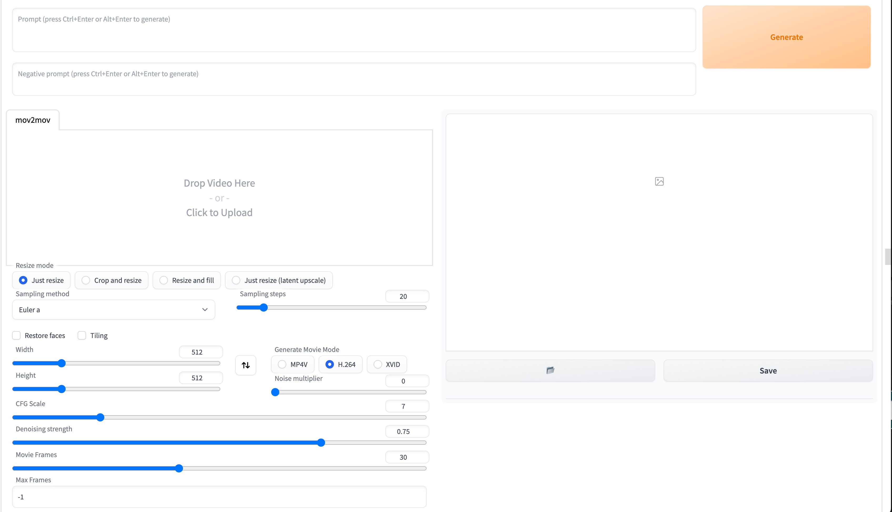
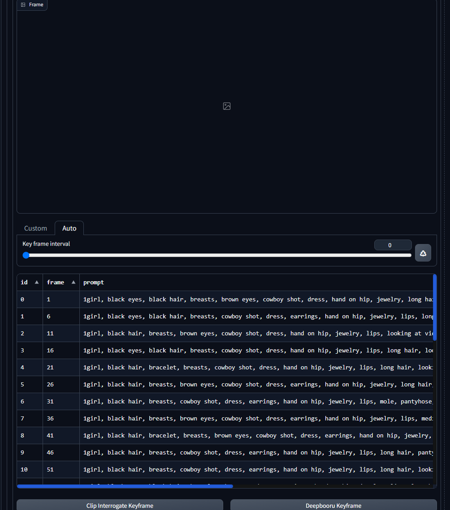

[English](README.md) | [中文简体](README_CN.md)

## Mov2mov This is the Mov2mov plugin for Automatic1111/stable-diffusion-webui.

Features:
- Directly process frames from videos
- Package into a video after processing
- Video Editing(beta)
  - Dramatically reduce video flicker by keyframe compositing!
  - You can customize the keyframe selection or auto-generate keyframes.
  - Backpropel keyframe tag
  - Currently only available for windows, if your system does not support, you can turn off this tab.

Also, mov2mov will work better with the [bg-mask](https://github.com/Scholar01/sd-webui-bg-mask) plugin 😃

# Table of Contents

- [Table of Contents](#table-of-contents)
  - [Usage Regulations](#usage-regulations)
  - [Installation](#installation)
  - [Change Log](#change-log)
  - [Instructions](#instructions)
  - [Thanks](#thanks)
## Usage Regulations

1. Please resolve the authorization issues of the video source on your own. Any problems caused by using unauthorized videos for conversion must be borne by the user. It has nothing to do with mov2mov!
2. Any video made with mov2mov and published on video platforms must clearly specify the source of the video used for conversion in the description. For example, if you use someone else's video and convert it through AI, you must provide a clear link to the original video; if you use your own video, you must also state this in the description.
3. All copyright issues caused by the input source must be borne by the user. Note that many videos explicitly state that they cannot be reproduced or copied!
4. Please strictly comply with national laws and regulations to ensure that the content is legal and compliant. Any legal responsibility caused by using this plugin must be borne by the user. It has nothing to do with mov2mov!

## Installation

1. Open the Extensions tab.
2. Click on Install from URL.
3. Enter the URL for the extension's git repository.
4. Click Install.
5. Restart WebUI.

## Change Log

[Change Log](CHANGELOG.md)

## Instructions

- Video tutorials:
  - [https://www.bilibili.com/video/BV1Mo4y1a7DF](https://www.bilibili.com/video/BV1Mo4y1a7DF)
  - [https://www.bilibili.com/video/BV1rY4y1C7Q5](https://www.bilibili.com/video/BV1rY4y1C7Q5)
- QQ channel: [https://pd.qq.com/s/akxpjjsgd](https://pd.qq.com/s/akxpjjsgd)
- Discord: [https://discord.gg/hUzF3kQKFW](https://discord.gg/hUzF3kQKFW)

## Thanks

- modnet-entry: [https://github.com/RimoChan/modnet-entry](https://github.com/RimoChan/modnet-entry)
- MODNet: [https://github.com/ZHKKKe/MODNet](https://github.com/ZHKKKe/MODNet)
- Ezsynth: [https://github.com/Trentonom0r3/Ezsynth](https://github.com/Trentonom0r3/Ezsynth)